# 👋 Hello World! I'm ParrotXray 🦜

<div align="center">
  
[](https://git.io/typing-svg)

</div>

## 🚀 About Me

```javascript
const ParrotXray = {
    pronouns: "He/Him",
    code: ["JavaScript", "TypeScript", "Python", "Rust", "ASM (AT&T syntax)"],
    technologies: {
        frontEnd: {
            js: ["React", "Next.js"],
            css: ["Tailwind CSS", "Sass", "Bootstrap"]
        },
        backEnd: {
            js: ["Node.js"],
            python: ["FastAPI", "Flask"],
            rust: ["Actix-web", "Rocket"]
        },
        databases: ["MongoDB", "MySQL", "MariaDB", "SQLite"],
        tools: ["Docker", "Git"],
        virtualization: ["Proxmox VE", "VMware ESXi", "Apache CloudStack"]
    },
    currentFocus: "Building scalable web applications with Rust & React",
    funFact: "I debug with console.log and I'm not ashamed! 🐛"
};
```

## 📊 GitHub Statistics

<div align="center">
  
  
</div>

<div align="center">
  
</div>

## 📈 Detailed GitHub Metrics
<div align="center">
  
</div>

## 🏆 GitHub Trophies
<div align="center">
  
</div>

## 💻 Tech Stack

<div align="center">

### 🌐 Frontend


### ⚡ Backend


### 🗄️ Database


### ☁️ DevOps & Tools


</div>

## 📈 Activity Graph
<div align="center">
  
</div>

## 🐍 Contribution Snake
<div align="center">
  <picture>
    <source media="(prefers-color-scheme: dark)" srcset="https://raw.githubusercontent.com/ParrotXray/ParrotXray/output/github-contribution-grid-snake-dark.svg">
    <source media="(prefers-color-scheme: light)" srcset="https://raw.githubusercontent.com/ParrotXray/ParrotXray/output/github-contribution-grid-snake.svg">
    
  </picture>
</div>

## 🔥 Recent Activity
<!--RECENT_ACTIVITY:start-->
1. 💬 Commented on [#1](https://github.com/AvianJay/DCTWFlet/pull/1#issuecomment-3501186005) in [AvianJay/DCTWFlet](https://github.com/AvianJay/DCTWFlet)<br>
2. 💬 Commented on [#1](https://github.com/AvianJay/DCTWFlet/pull/1#issuecomment-3497427497) in [AvianJay/DCTWFlet](https://github.com/AvianJay/DCTWFlet)<br>
3. 💬 Commented on [#1](https://github.com/AvianJay/DCTWFlet/pull/1#issuecomment-3497401923) in [AvianJay/DCTWFlet](https://github.com/AvianJay/DCTWFlet)<br>
4. 🎯 Pushed undefined commit(s) to [ParrotXray/dctwflet](https://github.com/ParrotXray/dctwflet)<br>
5. 🎯 Pushed undefined commit(s) to [ParrotXray/dctwflet](https://github.com/ParrotXray/dctwflet)<br>
<!--RECENT_ACTIVITY:end-->

## 📫 Connect with Me

<div align="center">

[](https://bsky.app/profile/cockatoochino.bsky.social)
[](https://discord.gg/W9WeC77DPZ)
[](https://www.pixiv.net/users/59922240)
[](https://twitter.com/CockatooChino)

</div>

---

<div align="center">
  
### 🌟 "Code is like humor. When you have to explain it, it's bad." – Cory House

**Thanks for visiting! 😄**


</div>

<p align="center">
     
</p>
